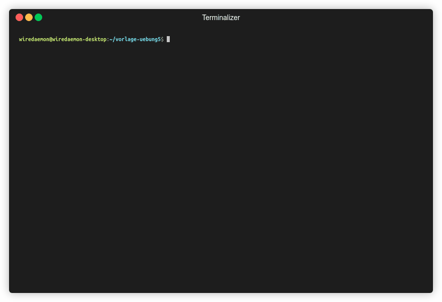
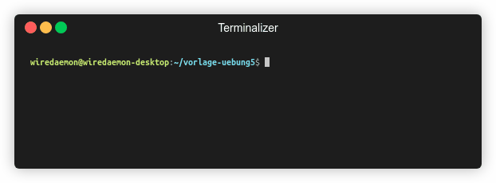

= Professionelle Softwareentwicklung: Übung 5
:icons: font
:icon-set: fa
:source-highlighter: rouge
:experimental:
ifdef::env-github[]
:tip-caption: :bulb:
:note-caption: :information_source:
:important-caption: :heavy_exclamation_mark:
:caution-caption: :fire:
:warning-caption: :warning:
endif::[]


== Testing

Diese Woche wollen wir uns mit Testing beschäftigen. Tests helfen uns bei vielen
Dingen. Beispielsweise bilden Sie ein Netz, welches uns auffängt, wenn wir eine
Anwendung refactorn, sie helfen unsere Funktionen besser zu verstehen und noch
vieles mehr. Daher ist es wichtig, dass Sie regelmäßig, zeitnah und ausreichend
viele Tests entwickeln.

Die Tests führen wir entweder direkt in der IDE aus, oder über die `gradle` tasks `check`, oder `test`

```
./gradlew check
```


=== Pure Functions testen

Wir wollen heute Software schreiben, die beim Auswerten von Klausuren helfen kann. Hierzu haben wir ihnen die `Ergebnis`-Klasse bereitgestellt, welche eine Punktzahl und Matrikelnummer enthält.


Aufgabenstellung:

Zum Beginn wollen wir ein paar pure Functions schreiben und testen. Hierzu haben wir in der Klasse `KlausurAuswertung` ein paar leere Funktionen erstellt, welche wir in `KlausurAuswertungTest` testen wollen.

NOTE: Verwenden Sie `@DisplayName` um den Tests noch eine etwas bessere Beschreibung zu geben.

. `getAnzahlBestanden` bekommt die Ergebnisse der Klausur sowie eine Bestehensgrenze übergeben und soll die Anzahl der bestandenen Studierenden ausrechnen. Schreiben Sie sowohl die Funktion, als auch einen Test dafür.
. `getPunkteDurchschnitt` bekommt die Ergebnisse der Klausur übergeben und soll den Punktedurchschnitt ausrechnen. Beachten Sie, dass Sie mit Fließkommazahlen rechnen, welche nie 100% exakt sind und daher mit `assertThat(…).isCloseTo()` testen sollten. Ein entsprechendes `Offset` Object können Sie mit der statischen `Offset.offset()` Methode erstellen. Sie können auch `Percentage` ausprobieren.
. `getBestandeneStudis` bekommt die Ergebnisse der Klausur sowie eine Bestehensgrenze übergeben und soll die Ergebnisse aller Studis als Liste wieder ausgeben.

TIP:  `getBestandeneStudis` lässt sich sehr schön mit der Stream API schreiben.

=== Testen mit Objekten

In Java arbeiten wir fast ausschließlich mit Objekten. Daher wollen wir uns in dieser Übung auch mit dem Testen von Objekten beschäftigen.

NOTE: Für diesen Teil sind die Klassen `Klausur` und `KlausurTest` relevant. Entfernen Sie die `@Disabled` Annotation von der `KlausurTest` Klasse um die darin enthaltenen Tests ausführen zu können.

Die `Klausur` Klasse soll eine Klausur in der echten Welt darstellen, wie Sie auch an der Universität stattfinden könnte. Die Idee ist, dass wir die Klasse mit den Ergebnissen der Studierenden erstellen und dann gleich aus dieser Instanz der Klasse alle Daten, welche für Dozierende, Mitarbeitende und Tutor:innen interessant sind, erhalten können.

. Schreiben Sie zunächst einen Test, welcher überprüft, dass der Punktedurchschnitt aus der Klasse `Klausur` korrekt ist.
. Da wir nun zwei verschiedene Wege im Programm haben an den Punktedurchschnitt zu gelangen, wollen wir sicherstellen, dass das Ergebnis dasselbe ist. Dabei soll sich das Ergebnis der `Klausur` Klasse an dem der `KlausurAuswertung` orientieren. Schreiben Sie einen Test, welcher überprüft, dass die Ergebnisse sich nicht unterscheiden.
. Implementieren Sie die `changeBestehensGrenze` Methode. Mit dieser soll die Bestehensgrenze geändert werden und der Zustand des Objektes korrekt aktualisiert werden. Schreiben Sie einen Test, welcher die `Klausur` Klasse mit den Daten aus `createTestErgebnisse()` und einer Bestehensgrenze von `15` initialisiert und anschließend die Klausur auf eine Bestehensgrenze von `12` herabsenkt. Überprüfen Sie, dass `getBestandeneStudis` stets das korrekte Ergebnis returned.
. Es kann auch sehr hilfreich sein, Tests zu schreiben, welche überprüfen, dass sich etwas *nicht* ändert. Der Punktedurchschnitt ist ebenfalls Zustand der Klasse und könnte verändert werden. Schreiben Sie einen Test, welcher überprüft, dass sich dieser bei Änderung der Bestehensgrenze *nicht* ändert.

=== Weiterführende Überlegungen

. Wir haben die statische Methode `createTestErgebnisse` genutzt, um Testdaten zu erzeugen und uns so den `Arrange` Schritt einfacher zu machen. Würde das auch mit `@Before` funktionieren? Hat die Lösung mit der statischen Methode Vorteile, oder bevorzugen Sie hier `@Before`? Diskutieren Sie.

== Tool der Woche: Terminalizer

https://terminalizer.com/[Terminalizer] ist ein Tool zum Aufnehmen einer Konsolensession.
Manchmal möchte man gerade auf übers Internet (z.B im Discussions Forum 😉) zeigen, was genau auf der Konsole passiert ist. Das ist jedoch mit herkömmlichen Screenrecordern leider aufwändig und vor allem werden die Videos oft viel zu groß.

NOTE: Wer Probleme beim Installieren unter Ubuntu hat, kann sich an folgenden Tipps orientieren: https://gist.github.com/volcan01010/6fcf7ae1f4975474ba9aac27efe17b84[Install instructions for terminalizer on Ubuntu 18.04 and 20.04]

Hier kommt Terminalizer ins Spiel, welches eine viel kleinere Aufnahme ermöglicht.

Mit `terminalizer record mysession` können wir die Aufnahme starten und mit `Strg+D` stoppen. Dabei wird eine `mysession.yml` Datei aufgezeichnet, welche wir jetzt sogar noch im Nachhinein manuell editieren können, wenn wir das wollen.

`terminalizer render mysession` wandelt die aufgezeichnete `mysession.yml` anschließend in eine Gif Datei um. Sollte uns diese immernoch zu groß sein, können wir sie noch im Nachhinein verkleinern indem wir z.B. https://gifcompressor.com/ nutzen.



Es gibt noch viele weitere Anpassungsmöglichkeiten und Optionen, welche unter https://terminalizer.com/docs sehr schön erklärt werden.


